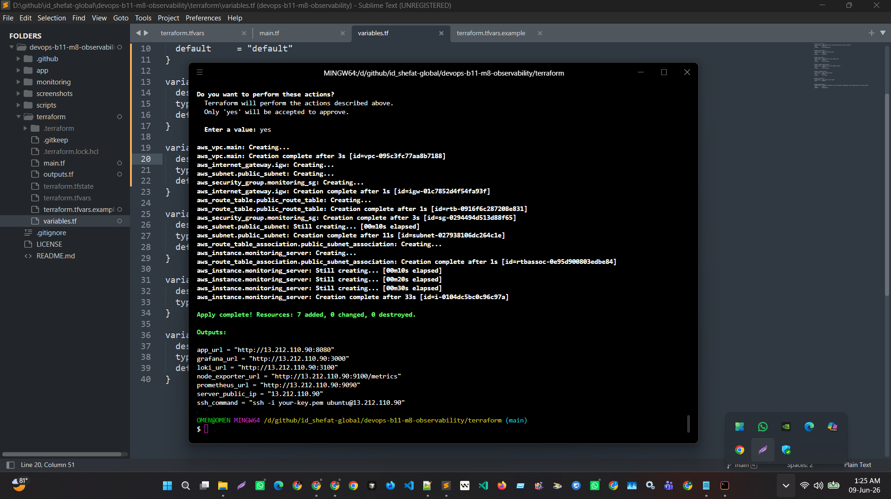
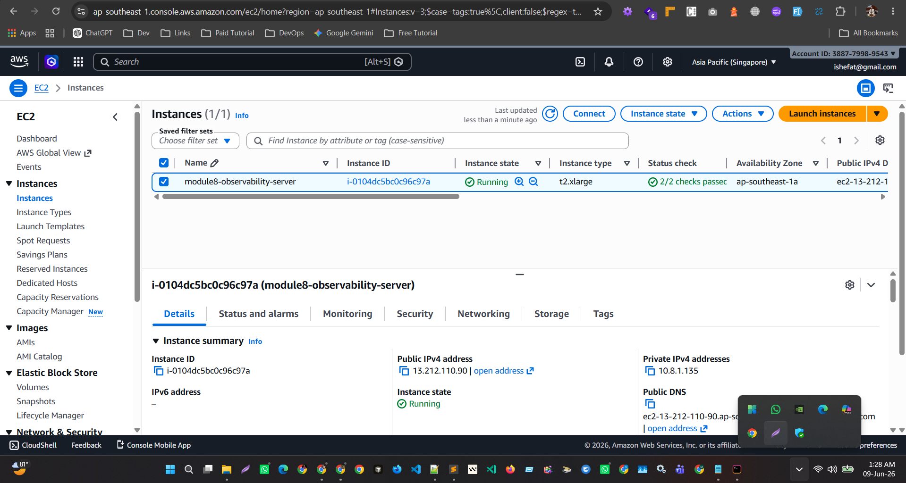
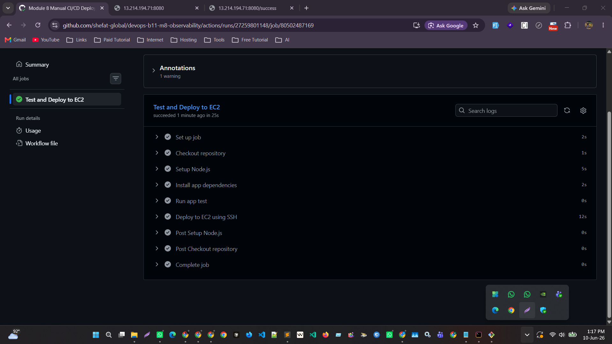
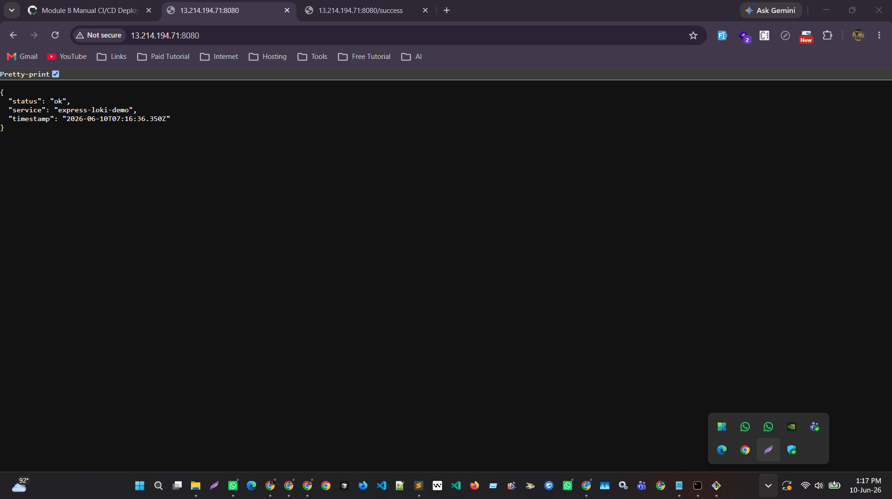
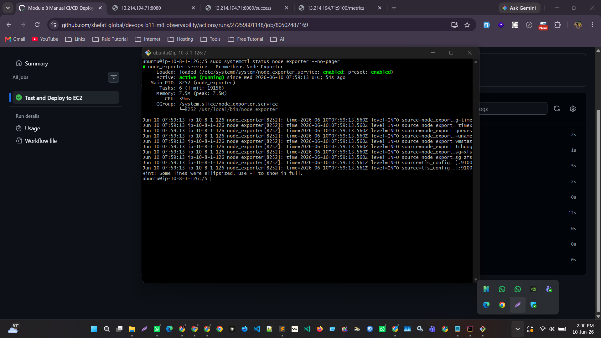
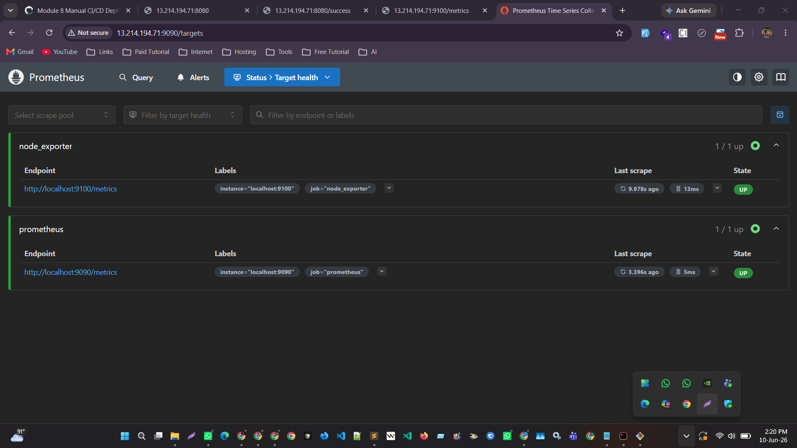
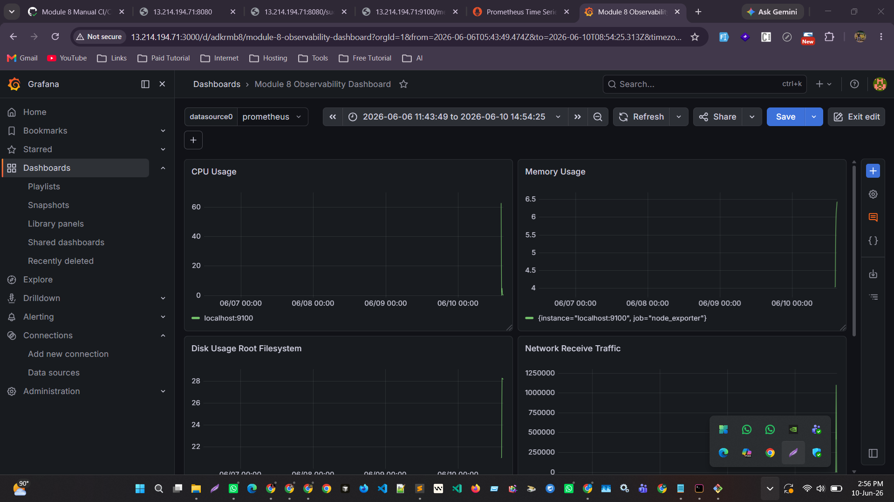
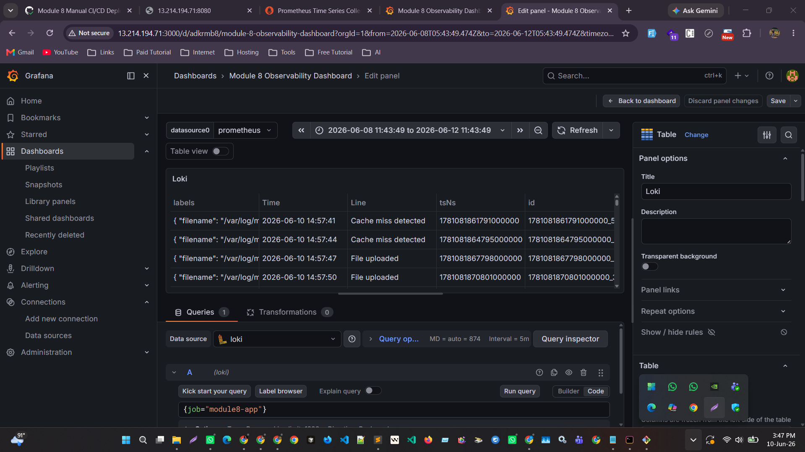
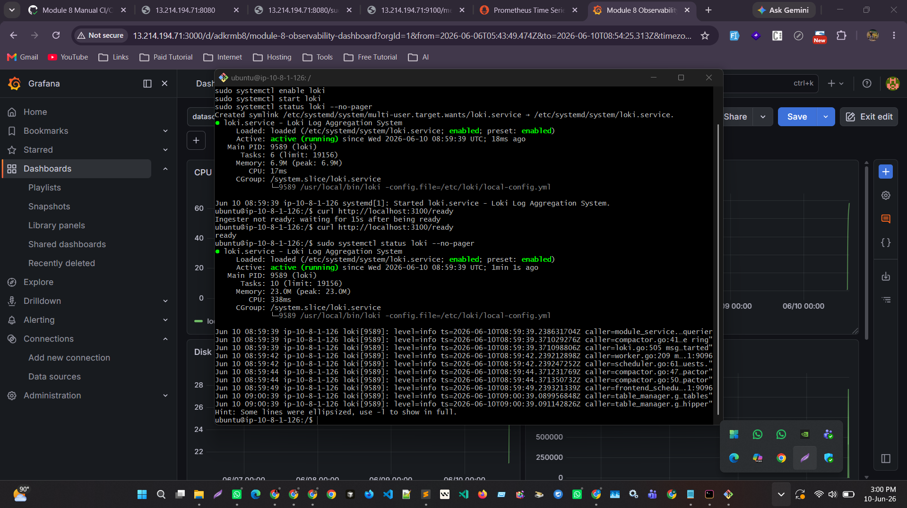
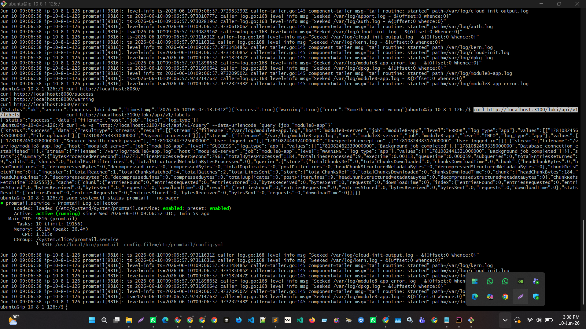

# Module 8 Assignment: DevOps Monitoring and Deployment Solution

## Project Overview

This repository contains my Module 8 DevOps assignment. In this project, I built a complete DevOps monitoring and deployment solution using Terraform, GitHub Actions, Grafana, Loki, Promtail, Node Exporter, and Prometheus.

The main goal of this assignment was to provision a cloud server using Terraform, deploy an application automatically using a CI/CD pipeline, and monitor the server metrics and logs using an observability stack.

I did not use Docker in this assignment because Docker was not covered in my lab. Instead, I installed and configured all required tools directly on the Ubuntu EC2 server using Linux systemd services.

## Assignment Requirements Covered

The assignment required the following tasks:

* Use Terraform to provision a cloud server
* Create a CI/CD pipeline for automated deployment
* Install and configure Grafana, Loki, Promtail, and Node Exporter
* Create a Grafana dashboard displaying CPU, Memory, Disk, Network metrics, and system logs
* Upload Terraform files, CI/CD configuration, Grafana dashboard export, documentation, and screenshots to GitHub

All of these requirements were completed in this project.

## Tools and Technologies Used

* AWS EC2
* Ubuntu Server
* Terraform
* GitHub Actions
* Node.js
* Express.js
* systemd
* Prometheus
* Node Exporter
* Grafana
* Loki
* Promtail

## Project Repository Structure

```text
devops-b11-m8-observability/
│
├── app/
│   ├── package.json
│   └── server.js
│
├── terraform/
│   ├── main.tf
│   ├── variables.tf
│   ├── outputs.tf
│   └── terraform.tfvars.example
│
├── monitoring/
│   ├── prometheus/
│   ├── loki/
│   ├── promtail/
│   └── grafana/
│
├── scripts/
│
├── screenshots/
│
├── .github/
│   └── workflows/
│       └── deploy.yml
│
├── README.md
└── .gitignore
```

## Step 1: Cloud Server Provisioning with Terraform

First, I created Terraform configuration files to provision the cloud infrastructure on AWS.

Terraform created the following resources:

* Custom VPC
* Public subnet
* Internet Gateway
* Public route table
* Security group
* Ubuntu EC2 instance

The EC2 server was used as the main monitoring and deployment server.

I used the following Terraform commands:

```bash
cd terraform
terraform init
terraform fmt
terraform validate
terraform plan
terraform apply
```

After running `terraform apply`, Terraform successfully created the EC2 server and gave me the output URLs for the application, Grafana, Prometheus, Node Exporter, and Loki.

Example Terraform output:

```text
app_url = "http://13.214.194.71:8080"
grafana_url = "http://13.214.194.71:3000"
loki_url = "http://13.214.194.71:3100"
node_exporter_url = "http://13.214.194.71:9100/metrics"
prometheus_url = "http://13.214.194.71:9090"
server_public_ip = "13.214.194.71"
```

## Step 2: CI/CD Deployment with GitHub Actions

After provisioning the EC2 server, I created a CI/CD pipeline using GitHub Actions.

At first, I used manual trigger deployment with `workflow_dispatch` because I wanted to test the deployment safely. Later, this can be changed to run automatically on push.

The GitHub Actions workflow performs the following tasks:

* Checks out the repository
* Sets up Node.js
* Installs application dependencies
* Runs a simple test
* Connects to the EC2 server using SSH
* Clones or updates the repository on the server
* Installs npm packages on the EC2 server
* Creates a systemd service for the application
* Restarts the application automatically

The CI/CD workflow file is located here:

```text
.github/workflows/deploy.yml
```

I added the following GitHub repository secrets:

```text
EC2_HOST
EC2_USER
EC2_SSH_KEY
```

After running the workflow manually from the GitHub Actions tab, the pipeline completed successfully and deployed the app to the EC2 server.

The application was available at:

```text
http://13.214.194.71:8080
```

I also tested the following routes:

```text
/
 /success
 /warning
 /error
 /cpu-stress?seconds=10
```

The `/error` route was intentionally created to generate error logs for Loki.

## Step 3: Application Setup

I used a simple Express.js application for deployment and log generation.

The app generates different types of logs:

* INFO
* SUCCESS
* WARNING
* ERROR

It also has a CPU stress endpoint to test CPU usage in Grafana.

The app files are located in:

```text
app/
```

The application runs as a systemd service named:

```text
module8-app
```

I checked the service using:

```bash
sudo systemctl status module8-app --no-pager
```

## Step 4: Node Exporter Installation

Next, I installed Node Exporter on the EC2 server.

Node Exporter was used to collect Linux system metrics such as:

* CPU usage
* Memory usage
* Disk usage
* Network traffic

I created a systemd service for Node Exporter:

```text
node_exporter.service
```

Then I started and enabled the service:

```bash
sudo systemctl daemon-reload
sudo systemctl enable node_exporter
sudo systemctl start node_exporter
sudo systemctl status node_exporter --no-pager
```

I verified Node Exporter from the browser:

```text
http://13.214.194.71:9100/metrics
```

## Step 5: Prometheus Installation

I installed Prometheus to scrape metrics from Node Exporter.

Prometheus was configured with two scrape jobs:

* Prometheus itself
* Node Exporter

The Prometheus configuration file was created at:

```text
/etc/prometheus/prometheus.yml
```

The main configuration was:

```yaml
global:
  scrape_interval: 15s

scrape_configs:
  - job_name: "prometheus"
    static_configs:
      - targets: ["127.0.0.1:9090"]

  - job_name: "node_exporter"
    static_configs:
      - targets: ["127.0.0.1:9100"]
```

I started Prometheus as a systemd service:

```bash
sudo systemctl enable prometheus
sudo systemctl start prometheus
sudo systemctl status prometheus --no-pager
```

Then I checked the Prometheus targets page:

```text
http://13.214.194.71:9090/targets
```

Both Prometheus and Node Exporter showed `UP`.

## Step 6: Grafana Installation

After Prometheus was working, I installed Grafana on the EC2 server.

I started Grafana using systemd:

```bash
sudo systemctl enable grafana-server
sudo systemctl start grafana-server
sudo systemctl status grafana-server --no-pager
```

Then I opened Grafana in the browser:

```text
http://13.214.194.71:3000
```

I logged in using the default admin account and changed the password.

## Step 7: Grafana Dashboard for Metrics

Inside Grafana, I added Prometheus as a data source using this URL:

```text
http://localhost:9090
```

Then I created a dashboard named:

```text
Module 8 Observability Dashboard
```

The dashboard includes panels for:

* CPU Usage
* Memory Usage
* Disk Usage
* Network Receive Traffic
* Network Transmit Traffic

The PromQL query used for CPU usage was:

```promql
100 - (avg by(instance) (rate(node_cpu_seconds_total{mode="idle"}[5m])) * 100)
```

The PromQL query used for memory usage was:

```promql
(1 - (node_memory_MemAvailable_bytes / node_memory_MemTotal_bytes)) * 100
```

The PromQL query used for disk usage was:

```promql
100 - ((node_filesystem_avail_bytes{mountpoint="/",fstype!~"tmpfs|overlay"} * 100) / node_filesystem_size_bytes{mountpoint="/",fstype!~"tmpfs|overlay"})
```

The PromQL query used for network receive traffic was:

```promql
rate(node_network_receive_bytes_total{device!="lo"}[5m])
```

The PromQL query used for network transmit traffic was:

```promql
rate(node_network_transmit_bytes_total{device!="lo"}[5m])
```

## Step 8: Loki Installation

After the metrics dashboard was ready, I installed Loki for log aggregation.

Loki was installed as a binary and configured with a local configuration file:

```text
/etc/loki/local-config.yml
```

I created a systemd service for Loki:

```text
loki.service
```

Then I started and enabled Loki:

```bash
sudo systemctl enable loki
sudo systemctl start loki
sudo systemctl status loki --no-pager
```

I tested Loki using:

```bash
curl http://localhost:3100/ready
```

It returned:

```text
ready
```

This confirmed that Loki was running successfully.

## Step 9: Promtail Installation

Next, I installed Promtail to collect logs and send them to Loki.

Promtail was configured to collect:

* Application logs from `/var/log/module8-app.log`
* Application error logs from `/var/log/module8-app-error.log`
* System logs from `/var/log/*.log`

The Promtail configuration file was created at:

```text
/etc/promtail/config.yml
```

The application log job used this label:

```text
job="module8-app"
```

The application error log job used this label:

```text
job="module8-app-error"
```

The system log job used this label:

```text
job="system-logs"
```

I created a systemd service for Promtail:

```text
promtail.service
```

Then I started and enabled Promtail:

```bash
sudo systemctl enable promtail
sudo systemctl start promtail
sudo systemctl status promtail --no-pager
```

Promtail was running successfully and sending logs to Loki.

## Step 10: Loki Log Visualization in Grafana

After Promtail started sending logs to Loki, I added Loki as a Grafana data source.

The Loki data source URL was:

```text
http://localhost:3100
```

Then I used Grafana Explore to test the logs.

The LogQL query used for application logs was:

```logql
{job="module8-app"}
```

The LogQL query used for error logs was:

```logql
{job="module8-app-error"}
```

I also added a Loki log panel to my Grafana dashboard using the query:

```logql
{job="module8-app"}
```

This allowed the dashboard to show both system metrics and application logs.

## Final Monitoring Flow

The final monitoring flow of this project is:

```text
Node Exporter → Prometheus → Grafana
Application Logs → Promtail → Loki → Grafana
System Logs → Promtail → Loki → Grafana
GitHub Actions → EC2 → systemd application deployment
```

## Final Result

At the end of the assignment, I successfully completed:

* Terraform cloud server provisioning
* GitHub Actions CI/CD deployment
* Node.js application deployment using systemd
* Node Exporter installation
* Prometheus metrics collection
* Grafana dashboard creation
* Loki log aggregation
* Promtail log forwarding
* Log visualization in Grafana
* Required screenshots and documentation

## Repository Link

```text
https://github.com/shefat-global/devops-b11-m8-observability
```

## Screenshots

### 1. Terraform Deployment Success

This screenshot shows that Terraform successfully provisioned the AWS infrastructure and created the EC2 server.



### 2. EC2 Server Created on AWS

This screenshot shows the EC2 instance created by Terraform and running successfully in the AWS console.



### 3. Successful CI/CD Pipeline Execution

This screenshot shows the GitHub Actions workflow completed successfully. The workflow tested the application and deployed it to the EC2 server using SSH.



### 4. Application Running on EC2

This screenshot shows that the Express application was successfully deployed and running on the EC2 public IP.



### 5. Node Exporter Running

This screenshot shows that the Node Exporter service is active and running on the EC2 server.



### 6. Prometheus Targets UP

This screenshot shows that Prometheus is successfully scraping both Prometheus and Node Exporter targets.



### 7. Grafana Metrics Dashboard

This screenshot shows the Grafana dashboard displaying CPU, Memory, Disk, and Network metrics.



### 8. Loki Log Visualization

This screenshot shows application logs visualized in Grafana using Loki.



### 9. Loki Running

This screenshot shows that the Loki systemd service is active and running.



### 10. Promtail Running

This screenshot shows that the Promtail systemd service is active and collecting logs.


